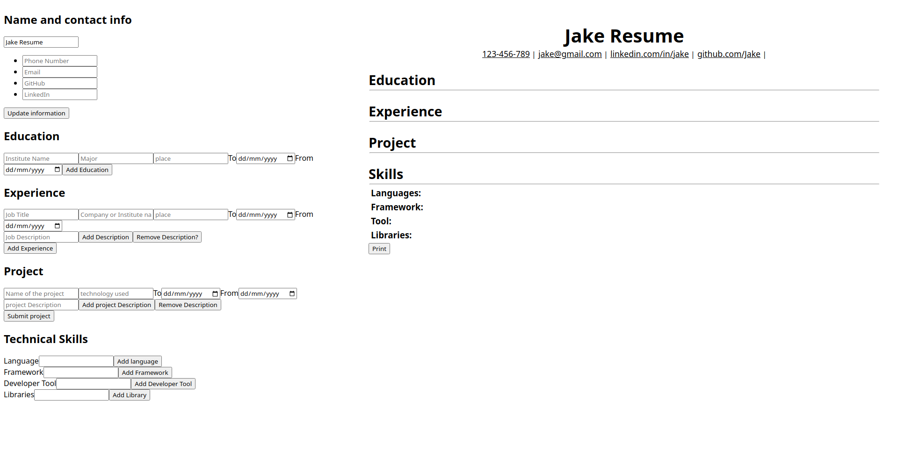

<h1 align="center" id="title">CV Builder</h1>

This project was part of The Odin Project's React curriculum. The main goal of this project was to build a CV based on Jake Resume format using React.  The CV generator consists of two main sections: the input and the visualization sections. In the control section, the user can input, edit and delete their information. The information inputted in the control section will be available in real-time in the visualization section. When finished, the user can then download their CV properly formatted in PDF. This project was made using React JS. 

<h2>Live</h2>

[https://cv-application-e79rlfmp9-lune3s-projects.vercel.app/](https://cv-application-e79rlfmp9-lune3s-projects.vercel.app/)

<h2>Project Screenshots:</h2>

  
  
<h2>🧐 Features</h2>

Here're some of the project's best features:

*   Real-time visualization
*   Users can download their CV in a formatted PDF file

  
  
<h2>💻 Built with</h2>

Technologies used in the project:

*   React JS
*   CSS